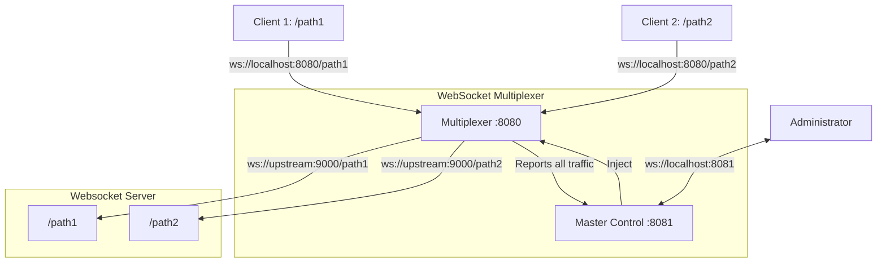

# WebSocket Multiplexer

This is a WebSocket multiplexer that acts as a proxy between clients and an upstream WebSocket server. It allows you to monitor and manipulate WebSocket traffic through a master control connection.




## Configuration

The multiplexer can be configured using environment variables:

- `PORT`: The port on which the multiplexer will listen for client connections (default: 8080)
- `MASTER_PORT`: The port on which the master control interface will be available (default: 8081)
- `UPSTREAM_URL`: The WebSocket server to which connections will be forwarded (default: ws://localhost:9000)
- `LOG_LEVEL`: Controls the verbosity of logging (default: INFO)
- `MESSAGE_QUEUE_TIMEOUT`: Time in milliseconds before queued messages are discarded (default: 30000)

## Example (using docker)

You can run the WebSocket multiplexer using Docker:

```bash
docker run \
  -p 8080:8080 \
  -p 8081:8081 \
  -e UPSTREAM_URL=wss://echo.websocket.org \
  -e LOG_LEVEL=DEBUG \
  ghcr.io/enexflow/websocket-multiplex:latest
```

## Logging

The multiplexer includes a comprehensive logging system with multiple verbosity levels:

- `ERROR`: Only critical errors are logged
- `WARN`: Errors and warnings are logged
- `INFO`: General operational information (default)
- `DEBUG`: Detailed information including message contents and connection events

You can set the logging level using the `LOG_LEVEL` environment variable:

```bash
LOG_LEVEL=DEBUG node websocket-multiplex.js
```

### Debug Logging

When `LOG_LEVEL` is set to `DEBUG`, the multiplexer provides detailed information about:

- Message contents (truncated if longer than 200 bytes)
- WebSocket protocol events (ping/pong)
- Connection upgrades
- Headers and status codes
- Queued message handling

Example debug log output:
```
[DEBUG] client -> multiplexer on /chat: {"id":"123","message":"Hello"}
[DEBUG] multiplexer -> ws://localhost:9000/chat: {"id":"123","message":"Hello"}
[DEBUG] Received ping from client /chat: empty
```

### Message Queuing

If a client sends messages before the upstream connection is established, messages are queued and:

- Held for delivery until the upstream connection is ready
- Discarded after the timeout period (default: 30 seconds)
- Logged with appropriate notifications to the master control

Example:
```bash
MESSAGE_QUEUE_TIMEOUT=60000 node websocket-multiplex.js
```

## How It Works

1. The multiplexer creates a WebSocket server that listens for client connections
2. A separate WebSocket server is created for the master control interface
3. When a client connects to a path (e.g., `/chat`), the multiplexer:
   - Creates a connection to the upstream server with the same path
   - Forwards messages between the client and upstream server
   - Reports all activity to the master control connection

## Master Control Connection

The master control connection allows you to:
- Monitor all WebSocket connections and messages
- Inject messages into any client or upstream connection

Connect to the master control at: `ws://localhost:{MASTER_PORT}`

### Master Message Types

The multiplexer sends several types of messages to the master control:

#### Status Messages
```javascript
{
  type: 'status',
  clients: ['/path1', '/path2'],  // Array of active client paths
  upstreams: ['/path1', '/path2'] // Array of active upstream paths
}
```

#### Connection Events
```javascript
{
  type: 'connection',
  event: 'client-connected',  // or 'client-disconnected', 'upstream-connected', 'upstream-disconnected'
  connectionId: '/path',
  ip: '127.0.0.1',           // Only for client-connected
  headers: { ... },          // Only for client-connected
  code: 1000,                // Only for disconnection events
  reason: 'Normal closure'   // Only for disconnection events
}
```

#### Message Events
```javascript
{
  type: 'message',
  direction: 'client-to-upstream',  // or 'upstream-to-client'
  connectionId: '/path',
  message: 'message content'
}
```

#### Queued Message Events
```javascript
{
  type: 'message',
  direction: 'client-to-upstream-dequeued',
  connectionId: '/path',
  message: 'message content',
  queuedAt: '2024-01-01T12:00:00.000Z',
  sentAt: '2024-01-01T12:00:01.000Z'
}
```

#### Error Events
```javascript
{
  type: 'error',
  event: 'upstream-error',
  connectionId: '/path',
  message: 'Error message',
  code: 'error code',
  target: 'upstream URL',
  time: '2024-01-01T12:00:00.000Z'
}
```

### Example: Multiplex a specific connection

```javascript
// Monitor raw messages from a specific client
const clientMonitor = new WebSocket('ws://localhost:8081/client/chat');
clientMonitor.on('message', (data) => {
  console.log('Raw client message:', data.toString());
});
// Send a message to all clients connected on /chat on the upstream
clientMonitor.send("Hello chat clients");

// Monitor raw messages from a specific upstream
const upstreamMonitor = new WebSocket('ws://localhost:8081/upstream/chat');
upstreamMonitor.on('message', (data) => {
  console.log('Raw upstream message:', data.toString());
});
upstreamMonitor.send("Hello chat server");
```

### Example: Connecting to Master Control

```javascript
const WebSocket = require('ws');

// Connect to master control
const master = new WebSocket('ws://localhost:8081');

master.on('open', () => {
  console.log('Connected to master control');
});

master.on('message', (data) => {
  const message = JSON.parse(data);
  console.log('Received from master:', message);
});
```

### Example: Monitoring Connections

When you connect to the master, you'll receive a status message with all current connections:

```javascript
master.on('message', (data) => {
  const message = JSON.parse(data);
  
  if (message.type === 'status') {
    console.log('Active clients:', message.clients);
    console.log('Active upstreams:', message.upstreams);
  }
  
  if (message.type === 'connection') {
    console.log(`Connection event: ${message.event} for ${message.connectionId}`);
  }
});
```

### Example: Monitoring Messages

```javascript
master.on('message', (data) => {
  const message = JSON.parse(data);
  
  if (message.type === 'message') {
    console.log(`Message ${message.direction} for ${message.connectionId}:`);
    console.log(message.message);
  }
});
```

### Example: Injecting Messages

You can inject messages to specific clients or upstreams:

```javascript
// Inject message to a specific client
master.send(JSON.stringify({
  type: 'inject',
  target: 'client:/chat',
  message: 'Hello from master!'
}));

// Inject message to a specific upstream
master.send(JSON.stringify({
  type: 'inject',
  target: 'upstream:/chat',
  message: 'Hello to upstream!'
}));

// Inject message to all clients
master.send(JSON.stringify({
  type: 'inject',
  target: 'all-clients',
  message: 'Broadcast to all clients'
}));

// Inject message to all upstreams
master.send(JSON.stringify({
  type: 'inject',
  target: 'all-upstreams',
  message: 'Broadcast to all upstreams'
}));
```

## Use Cases

- Debugging WebSocket applications
- Testing WebSocket server behavior
- Implementing custom protocol transformations
- Monitoring WebSocket traffic
- Creating a WebSocket gateway with custom logic

# OCPP WebSocket Multiplexer Test Client

This is a simple test client that connects to the WebSocket multiplexer and simulates an OCPP (Open Charge Point Protocol) session.

## Prerequisites

- Node.js (v14 or later)
- npm

## Installation

1. Install dependencies:

```bash
npm install
```

## Usage

1. Make sure the WebSocket multiplexer is running on the default port (8080).

2. Run the test client:

```bash
node test-ocpp-client.js
```

## What the Test Does

1. Connects to the multiplexer with a charge point ID "CP001"
2. Sends a BootNotification message
3. Sends a Heartbeat message after 5 seconds
4. Sends a StatusNotification after 10 seconds
5. Sends MeterValues after receiving a BootNotification response
6. Handles incoming messages from the server
7. Responds to Reset and RemoteStartTransaction commands
8. Sends a StopTransaction message when the process is terminated (Ctrl+C)

## Configuration

You can modify the following variables in the script to change the behavior:

- `WS_URL`: The URL of the multiplexer (default: ws://localhost:8080)
- `CHARGE_POINT_ID`: The ID of the charge point (default: CP001)
- `OCPP_VERSION`: The OCPP version to use (default: 1.6)
